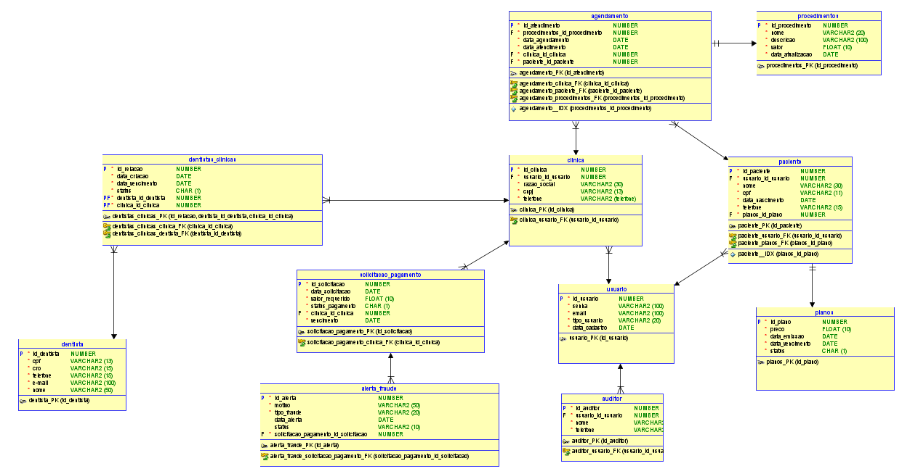
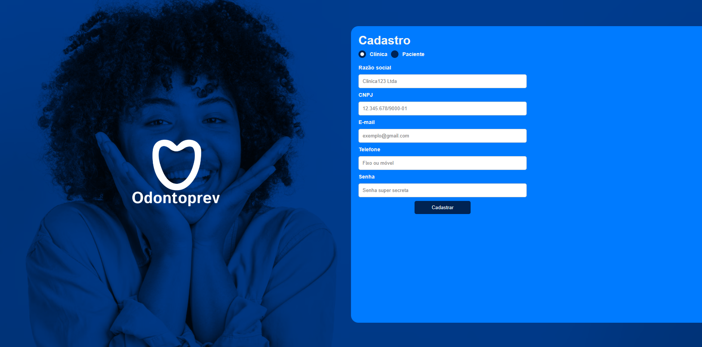
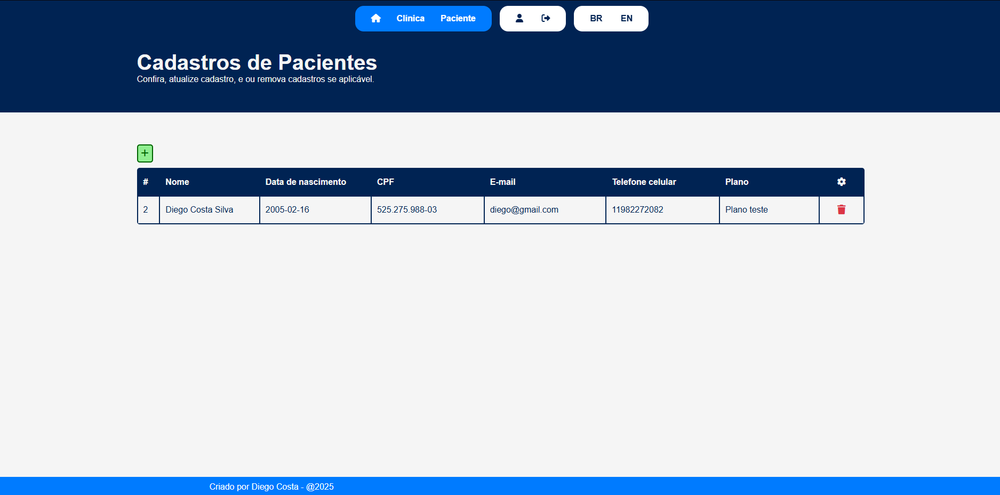

# Odontoprev-Java (Em desenvolvimento)

---
## 👥 Integrantes do Grupo

- **[Diego Costa Silva RM552648](https://www.linkedin.com/in/diegocostacs/)**: Desenvolvedor Java, frontend com Thymeleaf e mobile com React.
- **[Lucas Minozzo Bronzeri RM553745](https://www.linkedin.com/in/lucas-minozzo-bronzeri-b212a4248/)**: DevOps e Machine Learning.
- **[Thaís Ribeiro Asfur RM553870](https://github.com/ThaiisRibeiro)**: Quality Assurance e API em .NET (Minimal API).

---
## 📹 Apresentações

- **Demonstração da aplicação MVC:** [[Sprint 3] - Odontoprev](https://youtu.be/c4VNrUSmI-U)

---
## 🏥 Problema

Clínicas médicas fraudam atendimentos, exames e cirurgias, enquanto clientes podem utilizar os planos de forma indevida, gerando prejuízos para a Odontoprev.

## 💡 Solução

Nosso sistema end-to-end conecta a Odontoprev, clínicas e pacientes em um ecossistema integrado, facilitando auditorias e controle de informações.

- **Pacientes:** Aplicativo em React que permite agendamento de consultas e contratação de planos.
- **Backend:** Arquitetura baseada em microservices utilizando Java API + MVC, .NET Minimal API e Python para Machine Learning.
- **Web e Mobile:** A plataforma web é utilizada por clínicas, administradores e pacientes. Para pacientes, exclusivamente, há também um aplicativo mobile.

Essa solução oferece um ambiente centralizado, moderno e intuitivo para controle eficiente da Odontoprev.

---
## 🚀 Progresso na Sprint 4

Nesta última Sprint, realizamos diversas melhorias para otimizar a estrutura do sistema:

| Implementação                          | Descrição                                                                                                                                                    |
|----------------------------------------|----------------------------------------------------------------------------------------------------------------------------------------------------------------|
| **Nova classe**      | Classe de Agendamento (fundamental para o MVP)          |
| **Security**         | 	Foi implementado um FilterChain para controle de acesso baseado em roles nos endpoints. Além disso, foi utilizado o [Thymeleaf Extra](https://mvnrepository.com/artifact/org.thymeleaf.extras/thymeleaf-extras-springsecurity6) para ocultar elementos da interface conforme o perfil do usuário. Alguns endpoints, como de atualização, foram refatorados para não receber o id diretamente na URL, utilizando o UserDetails da aplicação para identificar o usuário autenticado, aumentando assim a segurança. |
| **Internacionalização**         |   	Textos como títulos (h2), labels, placeholders, botões e outros elementos agora podem ser alternados entre Português e Inglês.           |
| **Páginas de agendamento**               | Criadas páginas no frontend para o agendamento de consultas.                                         |
| **Utilização de IA**          | 	Integração com o modelo [Ollama Mistral](https://ollama.com/library/mistral) para análise dos agendamentos finalizados pelas clínicas.                                              |
| **RabbitMQ**          | Implementada uma fila que envia os dados do agendamento para análise pelo modelo de IA assim que o agendamento é submetido.                                            |
| **Actuator & Prometheus**          | Adicionadas as dependências do Spring Actuator e Prometheus para monitoramento e observabilidade da aplicação.                                          |

---
## 📌 Estrutura de Dados e Camadas do Projeto

### **Modelo Banco de Dados**



### **Entidades**
#### **Clínica**
- **id**: Identificador único da clínica.
- **nome**: Nome da clínica.
- **cnpj**: CNPJ da clínica.
- **telefone**: Telefone de contato.
- **usuario_id**: Referência às credenciais da clínica.

📂 **Arquitetura:**
- 📁 `/controller/ClinicaController.java`
- 📁 `/service/ClinicaService.java`
- 📁 `/repository/ClinicaRepository.java`
- 📁 `/dto/clinicaDTO/`

---
#### **Usuário**
- **id**: Identificador único do usuário.
- **email**: E-mail do usuário.
- **senha**: Senha de acesso.
- **data_cadastramento**: Data de criação da conta.
- **tipo_usuario**: Tipo de usuário (`PACIENTE`, `CLINICA`, `AUDITOR`).

📂 **Arquitetura:**
- 📁 `/controller/UsuarioController.java`
- 📁 `/service/UsuarioService.java`
- 📁 `/repository/UsuarioRepository.java`
- 📁 `/dto/usuarioDTO/`

---
#### **Paciente**
- **id**: Identificador único do paciente.
- **nome**: Nome completo.
- **cpf**: CPF do paciente.
- **data_nascimento**: Data de nascimento.
- **telefone**: Contato do paciente.
- **plano**: Referência ao plano odontológico escolhido.
- **usuario_id**: Referência às credenciais do paciente.

📂 **Arquitetura:**
- 📁 `/controller/PacienteController.java`
- 📁 `/service/PacienteService.java`
- 📁 `/repository/PacienteRepository.java`
- 📁 `/dto/pacienteDTO/`

---
#### **Agendamento**
- **id**: Identificador único do agendamento.
- **dataAgendamento**: Data do agendamento.
- **finalizadoEm**: Data atualizada quando a clínica finalizar atendimento.
- **status**: Uma enum com 2 status disponíveis: Marcada, Finalizada.
- **paciente**: Paciente atrelado ao agendamento.
- **clininca**: Clinica atrelada ao agendamento, escolhida pelo paciente.
- **precoAtendimento**: Valor preenchido pela clínica, referente ao custo gerado para o atendimento.
- **procedimento**: Procedimento marcado no agendamento.

📂 **Arquitetura:**
- 📁 `/controller/AgendamentoController.java`
- 📁 `/service/AgendamentoService.java`
- 📁 `/repository/AgendamentoService.java`
- 📁 `/dto/agendamentoDTO/`

---
#### **Procedimento**
- **id**: Identificador único do agendamento.
- **titulo**: Nome do procedimento. Uma Enum.
- **descricao**: Uma descrição do procedimento. Este campo será consultado pela IA posteriormente na análise de agendamento.
- **valorCobertura**: Um teto de reembolso para aquele procedimento. Um valor que a Odontoprev entenderia como o suficiente para realizar o procedimento.
- **status**: Um char de T(Ativo) ou F(Não-ativo).
- **dataAtualizacao**: Data de atualização de algum campo da classe.

📂 **Arquitetura:**
- 📁 `/controller/ProcedimentoController.java`
- 📁 `/service/ProcedimentoService.java`
- 📁 `/repository/ProcedimentoService.java`
- 📁 `/dto/procedimentoDTO/`

---
#### **Plano**
- **id**: Identificador único do agendamento.
- **nome**: Nome do plano.
- **descricao**: Uma descrição do plano.
- **preco**: Preço mensal do plano.
- **status**: Um char de T(Ativo) ou F(Não-ativo).
- **dataAtualizacao**: Data de atualização de algum campo da classe.

📂 **Arquitetura:**
- 📁 `/controller/PlanoController.java`
- 📁 `/service/PlanoService.java`
- 📁 `/repository/PlanoService.java`
- 📁 `/dto/planoDTO/`

---
## 🖥️ News Views e Endpoints

### **Parâmetros**
- `{role/tipo}`: Define o tipo de usuário (`clinica`, `paciente`, `auditor`).
- `{id}`: Identificador único do usuário.

### **Endpoints**

#### **GET View** `/`
Retorna a página inicial da aplicação.



#### **GET View** `/{tipo}/all`
Retorna uma lista de todos os usuários do tipo especificado (Acesso exclusivo para AUDITORES).



#### **GET View** `/{tipo}/edit/`
Retorna a página de edição do perfil do usuário (Acesso restrito ao próprio usuário e a auditores).


#### **GET View** `/agendamentos/`
Retorna uma página para cadastro e visualização de agendamentos (Acesso restrito a clínicas e pacientes).

**Visão clínica:**

**Visão paciente:**

#### **POST** `/{tipo}/register/`
Registra um novo usuário no sistema.

#### **POST** `/{tipo}/update/`
Atualiza os dados do usuário.

#### **POST** `/{tipo}/delete/{id}`
Remove o usuário do sistema.

---
## 📖 Como Rodar a Aplicação

### Dependências do Projeto
```gradle
plugins {
	id 'java'
	id 'org.springframework.boot' version '3.3.3'
	id 'io.spring.dependency-management' version '1.1.6'
}

dependencies {
	implementation 'org.springframework.boot:spring-boot-starter-amqp' // (NEW)
	implementation 'org.springframework.boot:spring-boot-starter-data-jpa' 
	implementation 'org.springframework.boot:spring-boot-starter-thymeleaf'
	implementation 'org.thymeleaf.extras:thymeleaf-extras-springsecurity6' // (NEW)
	implementation 'dev.langchain4j:langchain4j:0.36.2' // (NEW)
	implementation 'dev.langchain4j:langchain4j-ollama:0.36.2' // (NEW)
	implementation 'org.springframework.boot:spring-boot-starter-web'
	implementation 'org.springframework.boot:spring-boot-starter-validation'
	implementation 'org.springframework.boot:spring-boot-starter-actuator' // (NEW)
	implementation 'io.micrometer:micrometer-registry-prometheus' // (NEW)
	implementation 'org.springdoc:springdoc-openapi-starter-webmvc-ui:2.3.0'
	implementation 'org.springframework.boot:spring-boot-starter-security' // (NEW)
	compileOnly 'org.projectlombok:lombok:1.18.36'
	annotationProcessor 'org.projectlombok:lombok:1.18.36'
	runtimeOnly 'com.microsoft.sqlserver:mssql-jdbc:12.2.0.jre11'
	testImplementation 'org.springframework.boot:spring-boot-starter-test'
	testRuntimeOnly 'org.junit.platform:junit-platform-launcher'
}

```

### Passos para executar
1. **Clone o repositório:**
   ```sh
   git clone https://github.com/DiegoCostaSilva/Odontoprev-Java.git
   ```
2. **Acesse o diretório do projeto:**
   ```sh
   cd Odontoprev-Java
   ```
3. **Compile e construa o projeto com Gradle:**
   ```sh
   ./gradlew build
   ```
4. **Rode o RabbitMQ para testar mensageria:**
   
   No ```aplication.properties```  na variável ```spring.rabbitmq.host``` coloque o ip da sua máquina. Ou, crie uma variável de ambiente com a id  ```rabbitService```.
   
   Depois,
   ```
   docker run -it --rm --name rabbitmq -p 5672:5672 -p 15672:15672 rabbitmq:4-management
   ```
6. **Instale o [Ollama](https://ollama.com), e ao rodar, faça pull do modelo Mistral**
   ```
   ollama pull mistral
   ```
8. **Execute a aplicação:**
   ```sh
   ./gradlew bootRun
   ```
9. **Acesse no navegador:** [http://localhost:8080](http://localhost:8080)

