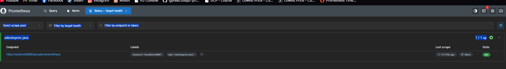
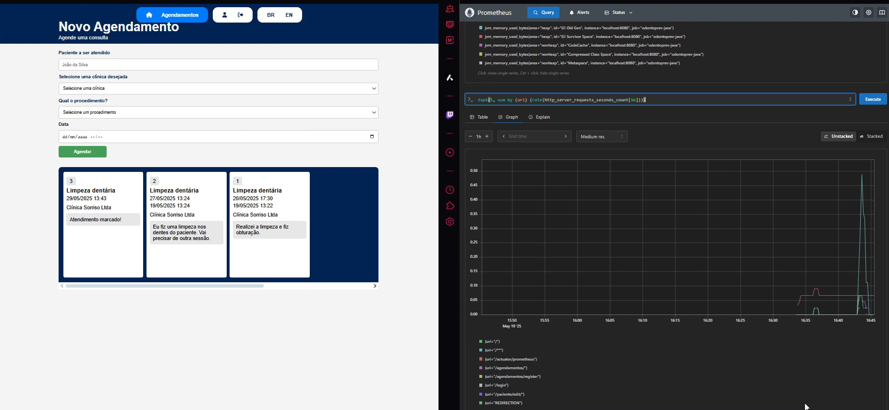

# Odontoprev-Java (Em desenvolvimento)

---
## 👥 Integrantes do Grupo

- **[Diego Costa Silva RM552648](https://www.linkedin.com/in/diegocostacs/)**: Desenvolvedor Java, frontend com Thymeleaf e mobile com React.
- **[Lucas Minozzo Bronzeri RM553745](https://www.linkedin.com/in/lucas-minozzo-bronzeri-b212a4248/)**: DevOps e Machine Learning.
- **[Thaís Ribeiro Asfur RM553870](https://github.com/ThaiisRibeiro)**: Quality Assurance e API em .NET (Minimal API).

---
## 📹 Apresentações

- **Demonstração da aplicação MVC:** [[Sprint 4] - Odontoprev](https://youtu.be/1M76XH1PcHc)

---
## 🏥 Problema

Clínicas médicas fraudam atendimentos, exames e cirurgias, enquanto clientes podem utilizar os planos de forma indevida, gerando prejuízos para a Odontoprev.

## 💡 Solução

Nosso sistema end-to-end conecta a Odontoprev, clínicas e pacientes em um ecossistema integrado, facilitando auditorias e controle de informações.

- **Pacientes:** Aplicativo em React que permite agendamento de consultas e contratação de planos.
- **Backend:** Arquitetura baseada em microservices utilizando Java API + MVC, .NET Minimal API e Python para Machine Learning.
- **Web e Mobile:** A plataforma web é utilizada por clínicas, administradores e pacientes. Para pacientes, exclusivamente, há também um aplicativo mobile.

Essa solução oferece um ambiente centralizado, moderno e intuitivo para controle eficiente da Odontoprev.

---
## ✨ Melhorias da Sprint 4

| Funcionalidade        | Descrição                                        |
| --------------------- | ------------------------------------------------ |
| Nova classe           | Agendamento (essencial para MVP)                 |
| Security              | FilterChain, Thymeleaf Extra, uso do UserDetails |
| Internacionalização   | Alternação PT/EN de textos                       |
| Frontend agendamentos | Páginas para pacientes e clínicas                |
| Integração IA         | Ollama Mistral para análise de agendamentos      |
| RabbitMQ              | Envia agendamento finalizado para IA             |
| Actuator & Prometheus | Observabilidade                                  |
---
## 📌 Estrutura de Dados e Camadas do Projeto

### **Modelo Banco de Dados**


### Principais entidades

* **Clínica**: nome, cnpj, telefone, usuario\_id
* **Usuário**: email, senha, tipo\_usuario
* **Paciente**: nome, cpf, data\_nascimento, plano
* **Auditor**: nome, telefone
* **Agendamento**: datas, status, procedimento, preco
* **Procedimento**: titulo, descricao, valorCobertura
* **Plano**: nome, descricao, preco, status

## 🕹️ Views e Endpoints

### Parâmetros:

* `{tipo}`: `clinica`, `paciente`, `auditor`
* `{id}`: identificador do usuário

### Principais endpoints

* `/` - Página inicial
* `/{tipo}/all` - Listagem (apenas para auditor)
* `/{tipo}/edit/` - Edição (restrita)
* `/agendamentos/` - Visualiza agendamentos (clínica e paciente)
* `/{tipo}/register/` - Cadastro
* `/{tipo}/update/` - Atualização
* `/{tipo}/delete/{id}` - Exclusão
* `/update/{idAgendamento}/clinica/` - Finaliza agendamento

---
## 🖥️ News Views e Endpoints

### **Parâmetros**
- `{role/tipo}`: Define o tipo de usuário (`clinica`, `paciente`, `auditor`).
- `{id}`: Identificador único do usuário.

### **Endpoints**

#### **GET View** `/`
Retorna a página inicial da aplicação.


#### **GET View** `/{tipo}/all`
Retorna uma lista de todos os usuários do tipo especificado (Acesso exclusivo para AUDITORES).


#### **GET View** `/{tipo}/edit/`
Retorna a página de edição do perfil do usuário (Acesso restrito ao próprio usuário e a auditores).


#### **GET View** `/agendamentos/`
Retorna uma página para cadastro e visualização de agendamentos (Acesso restrito a clínicas e pacientes).

**Visão clínica:**


**Visão paciente:**


---

## 📨 Mensageria (RabbitMQ)

Envio de agendamentos finalizados para análise por IA:

```properties
app.rabbitmq.queue=agendamento.queue
app.rabbitmq.exchange=agendamento.exchange
app.rabbitmq.routingkey=agendamento.routingkey
```

RabbitTemplate configurado para JSON:

```java
@Bean
public RabbitTemplate rabbitTemplate(ConnectionFactory cf) {
   RabbitTemplate rt = new RabbitTemplate(cf);
   rt.setMessageConverter(new Jackson2JsonMessageConverter());
   return rt;
}
```

---
## 🤖 IA com [LangChain4j](https://docs.langchain4j.dev) + [Mistral](https://ollama.com/library/mistral)

### Motivos da escolha:

* Rápido e leve para NLP
* Fácil integração via LangChain4j
* Flexível para prompts customizados

### Prompt com RTF (Role Task Format):

Verifica duração, descrição, valores e se condiz com o procedimento agendado.

```java
public String gerarPromptDeFraude(AgendamentoResponseDTO agendamento) {

        DateTimeFormatter formatter = DateTimeFormatter.ofPattern("dd/MM/yyyy HH:mm");

        return String.format(
                """
                Você é um assistente virtual de um auditor de uma empresa de saúde. Sua tarefa é analisar os dados de um agendamento e determinar se ele é suspeito de fraude.
                
                As datas estão no formato "dd/MM/yyyy HH:mm". Valores monetários estão em reais (R$).
                
                Analise os seguintes pontos com atenção:
                
                1. **Duração da consulta**: Verifique se há inconsistência entre a Data do Agendamento e a data de Finalização (tempo muito curto ou longo pode indicar fraude).
                2. **Descrição do atendimento**: Compare com a descrição esperada do procedimento (ou com palavras-chave esperadas). Caso a descrição esteja fora do escopo do procedimento, indique possível fraude.
                3. **Procedimentos realizados**: Verifique se houve adição de procedimentos não previstos originalmente. Fique atento a por exemplo: Limpeza, não se pode ter remoção de dentes. 
                4. **Preço do atendimento**: Compare com o valor de cobertura da empresa para identificar discrepâncias.
                
                Aqui estão os detalhes do agendamento para sua análise:
                
                ID do Agendamento: %d  
                Data do Agendamento: %s  
                Finalizado em: %s  
                Status do Agendamento: %s  
                Paciente: %s  
                Clínica: %s  
                Procedimento: %s  
                Cobertura de nossa empresa para o Procedimento: R$ %.2f  
                Preço do Atendimento: R$ %.2f  
                Descrição do atendimento (visão clínica): %s  
                Descrição do procedimento (visão Odontoprev): %s
                
                Com base nesses dados, determine se este agendamento apresenta sinais de fraude ou irregularidades. Sua resposta deve estar no formato JSON abaixo:
                
                {
                "fraude": true/false,
                "descricao_coerente": true/false,
                "resposta": "Explique claramente o motivo da classificação. Destaque sinais observados como duração atípica, preço fora da cobertura, ou descrição incompatível com o procedimento. Mesmo que não haja fraude, justifique brevemente o porquê."
                }
                """,
                agendamento.id(),
                agendamento.dataAgendamento().format(formatter),
                agendamento.finalizadoEm().format(formatter),
                agendamento.status(),
                agendamento.paciente(),
                agendamento.clinica(),
                agendamento.procedimento(),
                agendamento.procedimentoCobertura(),
                agendamento.atendimentoValor(),
                agendamento.descricaoAtendimento(),
                agendamento.descricaoProcedimento()
        );


    }
```

---
## 📊 Prometheus

1. Instale [Prometheus](https://prometheus.io)
2. Acesse `http://localhost:9090/`
3. Visualize métricas automaticamente da aplicação Java

Sozinho ele irá identificar a aplicação Java.



E, você poderá inserir queries e visualizar as métricas de forma gráfica.



---
## ⚖️ Configuração do Banco de Dados

### 1. Escolha o banco e adicione no `build.gradle`:

```gradle
// H2 (memória)
runtimeOnly 'com.h2database:h2'

// SQL Server
runtimeOnly 'com.microsoft.sqlserver:mssql-jdbc:12.2.0.jre11'

// Oracle
runtimeOnly 'com.oracle.database.jdbc:ojdbc11:21.7.0.0'
```

### 2. Configure `application.properties`

#### SQL Server

```properties
#spring.datasource.url=jdbc:sqlserver://sqlserver-java.database.windows.net:1433;database=javadb;encrypt=true;trustServerCertificate=false;hostNameInCertificate=*.database.windows.net;loginTimeout=30;
#spring.datasource.username=${dbUser}
#spring.datasource.password=${dbPass}
#spring.datasource.driver-class-name=com.microsoft.sqlserver.jdbc.SQLServerDriver
#spring.jpa.properties.hibernate.dialect=org.hibernate.dialect.SQLServerDialect
```

#### Oracle

```properties
spring.datasource.driver-class-name=oracle.jdbc.OracleDriver
spring.datasource.url=jdbc:oracle:thin:@oracle.fiap.com.br:1521:orcl
spring.datasource.username=${dbUser}
spring.datasource.password=${dbPass}
spring.jpa.properties.hibernate.dialect=org.hibernate.dialect.Oracle12cDialect
```

## ▶️ Executando a Aplicação

### Passos:

1. Clone o repositório:

```sh
git clone https://github.com/DiegoCostaSilva/Odontoprev-Java.git
```

2. Acesse o diretório:

```sh
cd Odontoprev-Java
```

3. Configure o `application.properties` com dados do banco e RabbitMQ
4. Rode o RabbitMQ (mensageria):

```sh
docker run -it --rm --name rabbitmq -p 5672:5672 -p 15672:15672 rabbitmq:4-management
```

5. Instale e inicie o [Ollama](https://ollama.com)

```sh
ollama pull mistral
```

6. Compile e execute:

```sh
./gradlew build
./gradlew bootRun
```

7. Acesse: [http://localhost:8080](http://localhost:8080)
