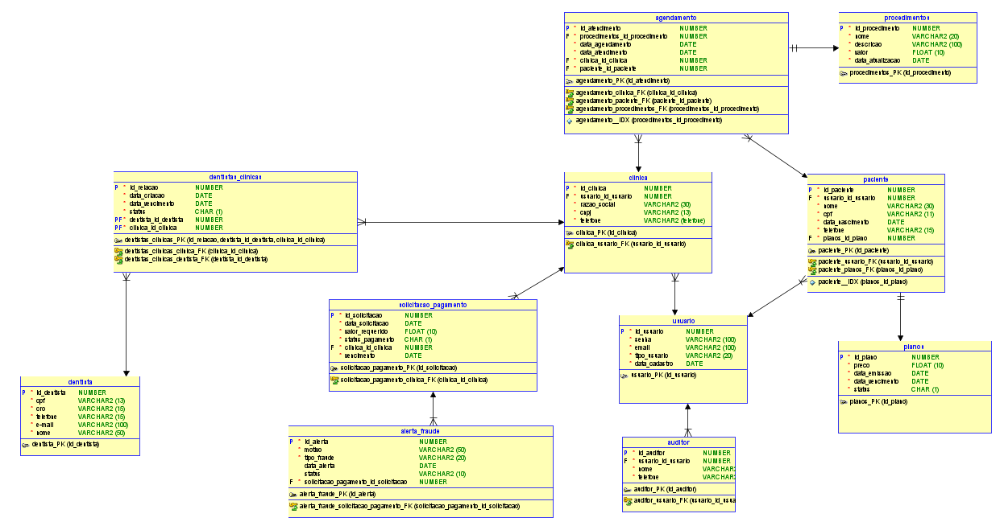
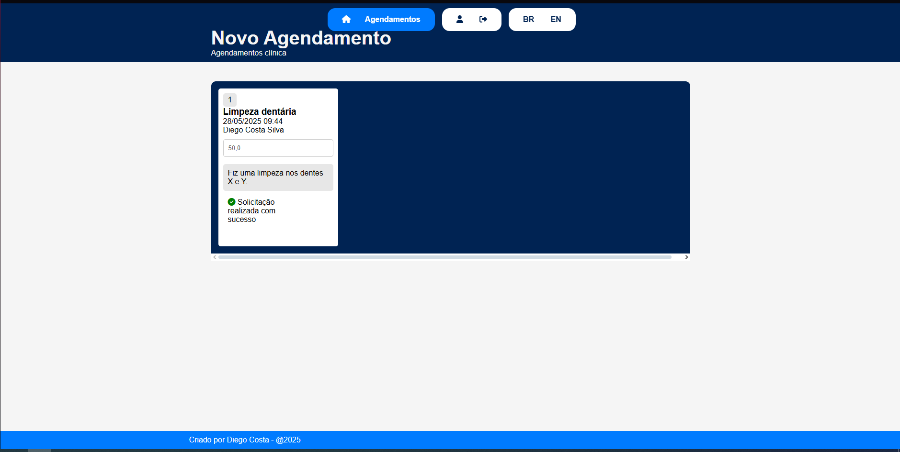
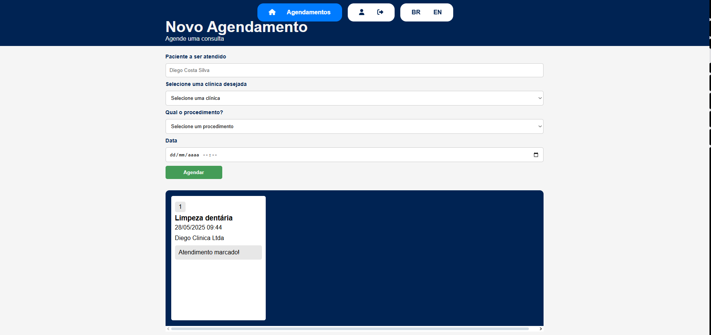

# Odontoprev-Java (Em desenvolvimento)

---
## 👥 Integrantes do Grupo

- **[Diego Costa Silva RM552648](https://www.linkedin.com/in/diegocostacs/)**: Desenvolvedor Java, frontend com Thymeleaf e mobile com React.
- **[Lucas Minozzo Bronzeri RM553745](https://www.linkedin.com/in/lucas-minozzo-bronzeri-b212a4248/)**: DevOps e Machine Learning.
- **[Thaís Ribeiro Asfur RM553870](https://github.com/ThaiisRibeiro)**: Quality Assurance e API em .NET (Minimal API).

---
## 📹 Apresentações

- **Demonstração da aplicação MVC:** [[Sprint 3] - Odontoprev](https://youtu.be/c4VNrUSmI-U)

---
## 🏥 Problema

Clínicas médicas fraudam atendimentos, exames e cirurgias, enquanto clientes podem utilizar os planos de forma indevida, gerando prejuízos para a Odontoprev.

## 💡 Solução

Nosso sistema end-to-end conecta a Odontoprev, clínicas e pacientes em um ecossistema integrado, facilitando auditorias e controle de informações.

- **Pacientes:** Aplicativo em React que permite agendamento de consultas e contratação de planos.
- **Backend:** Arquitetura baseada em microservices utilizando Java API + MVC, .NET Minimal API e Python para Machine Learning.
- **Web e Mobile:** A plataforma web é utilizada por clínicas, administradores e pacientes. Para pacientes, exclusivamente, há também um aplicativo mobile.

Essa solução oferece um ambiente centralizado, moderno e intuitivo para controle eficiente da Odontoprev.

---
## 🚀 Progresso na Sprint 4

Nesta última Sprint, realizamos diversas melhorias para otimizar a estrutura do sistema:

| Implementação                          | Descrição                                                                                                                                                    |
|----------------------------------------|----------------------------------------------------------------------------------------------------------------------------------------------------------------|
| **Nova classe**      | Classe de Agendamento (fundamental para o MVP)          |
| **Security**         | 	Foi implementado um FilterChain para controle de acesso baseado em roles nos endpoints. Além disso, foi utilizado o [Thymeleaf Extra](https://mvnrepository.com/artifact/org.thymeleaf.extras/thymeleaf-extras-springsecurity6) para ocultar elementos da interface conforme o perfil do usuário. Alguns endpoints, como de atualização, foram refatorados para não receber o id diretamente na URL, utilizando o UserDetails da aplicação para identificar o usuário autenticado, aumentando assim a segurança. |
| **Internacionalização**         |   	Textos como títulos (h2), labels, placeholders, botões e outros elementos agora podem ser alternados entre Português e Inglês.           |
| **Páginas de agendamento**               | Criadas páginas no frontend para o agendamento de consultas.                                         |
| **Utilização de IA**          | 	Integração com o modelo [Ollama Mistral](https://ollama.com/library/mistral) para análise dos agendamentos finalizados pelas clínicas.                                              |
| **RabbitMQ**          | Implementada uma fila que envia os dados do agendamento para análise pelo modelo de IA assim que o agendamento é submetido.                                            |
| **Actuator & Prometheus**          | Adicionadas as dependências do Spring Actuator e Prometheus para monitoramento e observabilidade da aplicação.                                          |

---
## 📌 Estrutura de Dados e Camadas do Projeto

### **Modelo Banco de Dados**

Importante dizer que a aplicação é um MVP, e não reflete totalmente o modelo de banco de dados, que imaginavamos para uma versão final.



### **Entidades**
#### **Clínica**
- **id**: Identificador único da clínica.
- **nome**: Nome da clínica.
- **cnpj**: CNPJ da clínica.
- **telefone**: Telefone de contato.
- **usuario_id**: Referência às credenciais da clínica.

📂 **Arquitetura:**
- 📁 `/controller/ClinicaController.java`
- 📁 `/service/ClinicaService.java`
- 📁 `/repository/ClinicaRepository.java`
- 📁 `/dto/clinicaDTO/`

---
#### **Usuário**
- **id**: Identificador único do usuário.
- **email**: E-mail do usuário.
- **senha**: Senha de acesso.
- **data_cadastramento**: Data de criação da conta.
- **tipo_usuario**: Tipo de usuário (`PACIENTE`, `CLINICA`, `AUDITOR`).

📂 **Arquitetura:**
- 📁 `/controller/UsuarioController.java`
- 📁 `/service/UsuarioService.java`
- 📁 `/repository/UsuarioRepository.java`
- 📁 `/dto/usuarioDTO/`

---
#### **Paciente**
- **id**: Identificador único do paciente.
- **nome**: Nome completo.
- **cpf**: CPF do paciente.
- **data_nascimento**: Data de nascimento.
- **telefone**: Contato do paciente.
- **plano**: Referência ao plano odontológico escolhido.
- **usuario_id**: Referência às credenciais do paciente.

📂 **Arquitetura:**
- 📁 `/controller/PacienteController.java`
- 📁 `/service/PacienteService.java`
- 📁 `/repository/PacienteRepository.java`
- 📁 `/dto/pacienteDTO/`

---
#### **Auditor**
- **id**: Identificador único do agendamento.
- **nome**: Nome do plano.
- **telefone**: Contato do auditor.
- **usuario_id**: Referência às credenciais do paciente.

  📂 **Arquitetura:**
- 📁 `/controller/AuditorController.java`
- 📁 `/service/AuditorService.java`
- 📁 `/repository/AuditorRepository.java`
- 📁 `/dto/auditorDTO/`

---
#### **Agendamento**
- **id**: Identificador único do agendamento.
- **dataAgendamento**: Data do agendamento.
- **finalizadoEm**: Data atualizada quando a clínica finalizar atendimento.
- **status**: Uma enum com 2 status disponíveis: Marcada, Finalizada.
- **paciente**: Paciente atrelado ao agendamento.
- **clininca**: Clinica atrelada ao agendamento, escolhida pelo paciente.
- **precoAtendimento**: Valor preenchido pela clínica, referente ao custo gerado para o atendimento.
- **procedimento**: Procedimento marcado no agendamento.

📂 **Arquitetura:**
- 📁 `/controller/AgendamentoController.java`
- 📁 `/service/AgendamentoService.java`
- 📁 `/repository/AgendamentoRepository.java`
- 📁 `/dto/agendamentoDTO/`

---
#### **Procedimento**
- **id**: Identificador único do agendamento.
- **titulo**: Nome do procedimento. Uma Enum.
- **descricao**: Uma descrição do procedimento. Este campo será consultado pela IA posteriormente na análise de agendamento.
- **valorCobertura**: Um teto de reembolso para aquele procedimento. Um valor que a Odontoprev entenderia como o suficiente para realizar o procedimento.
- **status**: Um char de T(Ativo) ou F(Não-ativo).
- **dataAtualizacao**: Data de atualização de algum campo da classe.

📂 **Arquitetura:**
- 📁 `/controller/ProcedimentoController.java`
- 📁 `/service/ProcedimentoService.java`
- 📁 `/repository/ProcedimentoRepository.java`
- 📁 `/dto/procedimentoDTO/`

---
#### **Plano**
- **id**: Identificador único do agendamento.
- **nome**: Nome do plano.
- **descricao**: Uma descrição do plano.
- **preco**: Preço mensal do plano.
- **status**: Um char de T(Ativo) ou F(Não-ativo).
- **dataAtualizacao**: Data de atualização de algum campo da classe.

📂 **Arquitetura:**
- 📁 `/controller/PlanoController.java`
- 📁 `/service/PlanoService.java`
- 📁 `/repository/PlanoRepository.java`
- 📁 `/dto/planoDTO/`

`

---
## 🖥️ News Views e Endpoints

### **Parâmetros**
- `{role/tipo}`: Define o tipo de usuário (`clinica`, `paciente`, `auditor`).
- `{id}`: Identificador único do usuário.

### **Endpoints**

#### **GET View** `/`
Retorna a página inicial da aplicação.


#### **GET View** `/{tipo}/all`
Retorna uma lista de todos os usuários do tipo especificado (Acesso exclusivo para AUDITORES).


#### **GET View** `/{tipo}/edit/`
Retorna a página de edição do perfil do usuário (Acesso restrito ao próprio usuário e a auditores).


#### **GET View** `/agendamentos/`
Retorna uma página para cadastro e visualização de agendamentos (Acesso restrito a clínicas e pacientes).

**Visão clínica:**



**Visão paciente:**



#### **POST** `/{tipo}/register/`
Registra um novo usuário no sistema.

#### **POST** `/{tipo}/update/`
Atualiza os dados do usuário.

#### **POST** `/{tipo}/delete/{id}`
Remove o usuário do sistema.

#### **POST** `/update/{idAgendamento}/clinica/`
Atualiza os dados do agendamento/atendimento.

---
## 📮 Mensageria

Utilizamos a mensageria, para capturar a finalização de um agendamento, e envia para o serviço de IA, que irá analisar o procedimento e o valor cobrado pela clínica.

Informações de fila são passadas no arquivo `application.properties` e recebidas pelas classes como variáveis de ambiente.:

```properties
app.rabbitmq.queue=agendamento.queue
app.rabbitmq.exchange=agendamento.exchange
app.rabbitmq.routingkey=agendamento.routingkey
```

Como passamos dados dos agendamentos pela mensagem, configuramos a conversão para Json, evitando problemas de serialização.

```java
    @Bean
   public RabbitTemplate rabbitTemplate(final ConnectionFactory connectionFactory) {
      final var rabbitTemplate = new RabbitTemplate(connectionFactory);
      rabbitTemplate.setMessageConverter(producerJackson2MessageConverter());
      return rabbitTemplate;
   }
   
   @Bean
   public Jackson2JsonMessageConverter producerJackson2MessageConverter() {
      return new Jackson2JsonMessageConverter();
   }
```

**💥 Producer/trigger**

```java
@Service
public class AgendamentoProducer {

   private static final Logger log = LoggerFactory.getLogger(AgendamentoProducer.class);

   private final RabbitTemplate rabbitTemplate;
   private final String exchange;
   private final String routingKey;


   public AgendamentoProducer(RabbitTemplate rabbitTemplate,
                              @Value("${app.rabbitmq.exchange}") String exchange,
                              @Value("${app.rabbitmq.routingkey}")String routingKey) {
      this.rabbitTemplate = rabbitTemplate;
      this.exchange = exchange;
      this.routingKey = routingKey;
   }

   public void enviarParaFIladeAnaliseAI(AgendamentoResponseDTO agendamento) {
      log.info("Enviando agendamento para fila de análise: {}", agendamento);
      rabbitTemplate.convertAndSend(exchange, routingKey, agendamento);
      log.info("Agendamento enviado para fila de análise!");
   }

}
```

**🚚 Consumer**

```java
@Component
public class AgendamentoConsumer {

    private static final Logger log = LoggerFactory.getLogger(AgendamentoConsumer.class);

    @Autowired
    private MistralService mistralService;

    @RabbitListener(queues = "${app.rabbitmq.queue}")
    public void processarAgendamento(AgendamentoResponseDTO agendamento) {
        log.info("Agendamento recebido: {}", agendamento);

        MistralPromptResponseDTO resultado = mistralService.verificarAgendamento(agendamento);

        if (resultado.fraude()) {
            log.warn("Fraude detectada no agendamento ID: {}", agendamento.id());
        } else {
            log.info("Agendamento ID {} verificado como legítimo.", agendamento.id());
        }

        log.info("Detalhes da IA: {}", resultado.resposta());
    }
}
```

---
## 🤖 Modelo de IA

Utilizamos o modelo **Mistral**, integrado ao sistema por meio da biblioteca [LangChain4j](https://github.com/langchain4j/langchain4j). A escolha do Mistral foi motivada por sua capacidade de lidar com prompts complexos e fornecer respostas rápidas e precisas, essenciais para a análise de agendamentos e detecção de fraudes.

### **Por que escolhemos o Mistral?**
- **Desempenho:** O Mistral é otimizado para tarefas de processamento de linguagem natural, garantindo análises rápidas.
- **Flexibilidade:** Permite a personalização de prompts para atender às necessidades específicas do projeto.
- **Integração:** Compatível com a biblioteca LangChain4j, facilitando a comunicação com o backend Java.

### **Prompt Utilizado**

Misturamos instruções, regras, e dados do agendamento (sem expor dados sensíveis) para gerar um prompt que guiasse a IA na análise de possíveis fraudes.

Estratégia de RTF [**Role Task Format**](https://www.tiago.cafe/engenharia-de-prompt-inteligencia-artificial-no-gerenciamento-de-projetos/#o-que-é-a-fórmula-rtf).

```java
public String gerarPromptDeFraude(AgendamentoResponseDTO agendamento) {

        DateTimeFormatter formatter = DateTimeFormatter.ofPattern("dd/MM/yyyy HH:mm");

        return String.format(
                """
                Você é um assistente virtual de um auditor de uma empresa de saúde. Sua tarefa é analisar os dados de um agendamento e determinar se ele é suspeito de fraude.
                
                As datas estão no formato "dd/MM/yyyy HH:mm". Valores monetários estão em reais (R$).
                
                Analise os seguintes pontos com atenção:
                
                1. **Duração da consulta**: Verifique se há inconsistência entre a Data do Agendamento e a data de Finalização (tempo muito curto ou longo pode indicar fraude).
                2. **Descrição do atendimento**: Compare com a descrição esperada do procedimento (ou com palavras-chave esperadas). Caso a descrição esteja fora do escopo do procedimento, indique possível fraude.
                3. **Procedimentos realizados**: Verifique se houve adição de procedimentos não previstos originalmente. Fique atento a por exemplo: Limpeza, não se pode ter remoção de dentes. 
                4. **Preço do atendimento**: Compare com o valor de cobertura da empresa para identificar discrepâncias.
                
                Aqui estão os detalhes do agendamento para sua análise:
                
                ID do Agendamento: %d  
                Data do Agendamento: %s  
                Finalizado em: %s  
                Status do Agendamento: %s  
                Paciente: %s  
                Clínica: %s  
                Procedimento: %s  
                Cobertura de nossa empresa para o Procedimento: R$ %.2f  
                Preço do Atendimento: R$ %.2f  
                Descrição do atendimento (visão clínica): %s  
                Descrição do procedimento (visão Odontoprev): %s
                
                Com base nesses dados, determine se este agendamento apresenta sinais de fraude ou irregularidades. Sua resposta deve estar no formato JSON abaixo:
                
                {
                "fraude": true/false,
                "descricao_coerente": true/false,
                "resposta": "Explique claramente o motivo da classificação. Destaque sinais observados como duração atípica, preço fora da cobertura, ou descrição incompatível com o procedimento. Mesmo que não haja fraude, justifique brevemente o porquê."
                }
                """,
                agendamento.id(),
                agendamento.dataAgendamento().format(formatter),
                agendamento.finalizadoEm().format(formatter),
                agendamento.status(),
                agendamento.paciente(),
                agendamento.clinica(),
                agendamento.procedimento(),
                agendamento.procedimentoCobertura(),
                agendamento.atendimentoValor(),
                agendamento.descricaoAtendimento(),
                agendamento.descricaoProcedimento()
        );


    }
```

---
## 📖 Como Rodar a Aplicação

### Dependências do Projeto
```gradle
plugins {
	id 'java'
	id 'org.springframework.boot' version '3.3.3'
	id 'io.spring.dependency-management' version '1.1.6'
}

dependencies {
	implementation 'org.springframework.boot:spring-boot-starter-amqp' // (NEW)
	implementation 'org.springframework.boot:spring-boot-starter-data-jpa' 
	implementation 'org.springframework.boot:spring-boot-starter-thymeleaf'
	implementation 'org.thymeleaf.extras:thymeleaf-extras-springsecurity6' // (NEW)
	implementation 'dev.langchain4j:langchain4j:0.36.2' // (NEW)
	implementation 'dev.langchain4j:langchain4j-ollama:0.36.2' // (NEW)
	implementation 'org.springframework.boot:spring-boot-starter-web'
	implementation 'org.springframework.boot:spring-boot-starter-validation'
	implementation 'org.springframework.boot:spring-boot-starter-actuator' // (NEW)
	implementation 'io.micrometer:micrometer-registry-prometheus' // (NEW)
	implementation 'org.springdoc:springdoc-openapi-starter-webmvc-ui:2.3.0'
	implementation 'org.springframework.boot:spring-boot-starter-security' // (NEW)
	compileOnly 'org.projectlombok:lombok:1.18.36'
	annotationProcessor 'org.projectlombok:lombok:1.18.36'
	runtimeOnly 'com.microsoft.sqlserver:mssql-jdbc:12.2.0.jre11'
	testImplementation 'org.springframework.boot:spring-boot-starter-test'
	testRuntimeOnly 'org.junit.platform:junit-platform-launcher'
}

```

### Passos para executar
1. **Clone o repositório:**
   ```sh
   git clone https://github.com/DiegoCostaSilva/Odontoprev-Java.git
   ```
2. **Acesse o diretório do projeto:**
   ```sh
   cd Odontoprev-Java
   ```
3. **Variáveis no `aplication.properties`**
      
   Os valores entro `> <` podem ser declarados hardcoded, ou passados como variáveis de ambiente.
   
   ```properties
   spring.datasource.url= >sua connection string<
   spring.datasource.username= >username do seu banco<
   spring.datasource.password= >senha<
   spring.datasource.driver-class-name=com.microsoft.sqlserver.jdbc.SQLServerDriver
   spring.jpa.properties.hibernate.dialect=org.hibernate.dialect.SQLServerDialect

   #RabbitMQ

   spring.rabbitmq.host= >Localhost ou IP da máquina onde está rodando o RabbitMQ<
   spring.rabbitmq.port=5672
   spring.rabbitmq.username=guest
   spring.rabbitmq.password=guest

   app.rabbitmq.queue=agendamento.queue
   app.rabbitmq.exchange=agendamento.exchange
   app.rabbitmq.routingkey=agendamento.routingkey
   ```

5. **Rode o RabbitMQ para testar mensageria:**

   ```
   docker run -it --rm --name rabbitmq -p 5672:5672 -p 15672:15672 rabbitmq:4-management
   ```
   
6. **Instale o [Ollama](https://ollama.com), e ao rodar, abra o CMD da sua máquina e faça pull do modelo Mistral**
   ```
   ollama pull mistral
   ```
7. **Compile e construa o projeto com Gradle:**
   ```sh
   ./gradlew build
   ```
8. **Execute a aplicação:**
   ```sh
   ./gradlew bootRun
   ```
9. **Acesse no navegador:** [http://localhost:8080](http://localhost:8080)

