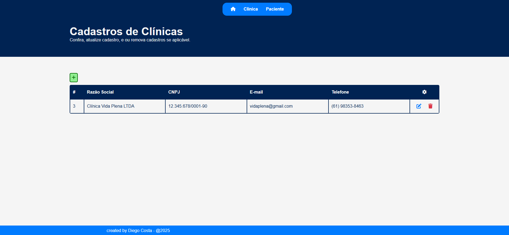
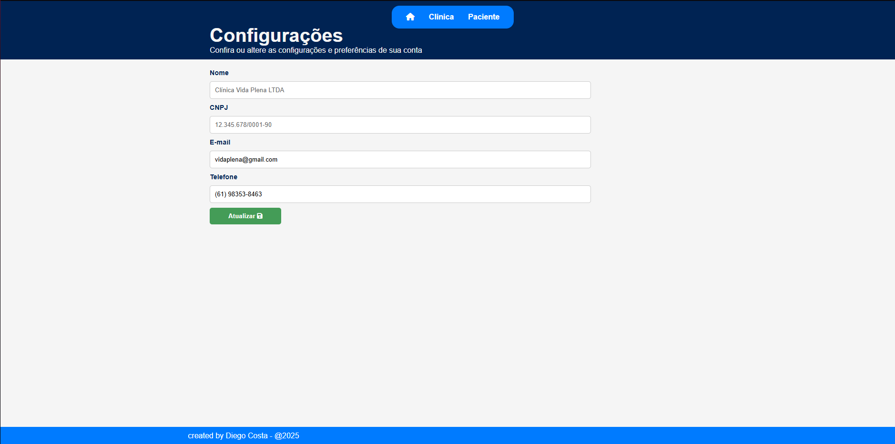

# Odontoprev-Java (Em desenvolvimento)

---
## 👥 Integrantes do Grupo

- **[Diego Costa Silva RM552648](https://www.linkedin.com/in/diegocostacs/)**: Desenvolvedor Java, frontend com Thymeleaf e mobile com React.
- **[Lucas Minozzo Bronzeri RM553745](https://www.linkedin.com/in/lucas-minozzo-bronzeri-b212a4248/)**: DevOps e Machine Learning.
- **[Thaís Ribeiro Asfur RM553870](https://github.com/ThaiisRibeiro)**: Quality Assurance e API em .NET (Minimal API).

---
## 📹 Apresentações

- **Pitch da Proposta Tecnológica:** [Assista aqui](https://youtu.be/SBQ-_mBXdK0)
- **Demonstração da aplicação MVC:** [[Sprint 3] - Odontoprev](https://youtu.be/c4VNrUSmI-U)

---
## 🏥 Problema

Clínicas médicas fraudam atendimentos, exames e cirurgias, enquanto clientes podem utilizar os planos de forma indevida, gerando prejuízos para a Odontoprev.

## 💡 Solução

Nosso sistema end-to-end conecta a Odontoprev, clínicas e pacientes em um ecossistema integrado, facilitando auditorias e controle de informações.

- **Pacientes:** Aplicativo em React que permite agendamento de consultas e contratação de planos.
- **Backend:** Arquitetura baseada em microservices utilizando Java API + MVC, .NET Minimal API e Python para Machine Learning.
- **Web e Mobile:** A plataforma web é utilizada por clínicas, administradores e pacientes. Para pacientes, exclusivamente, há também um aplicativo mobile.

Essa solução oferece um ambiente centralizado, moderno e intuitivo para controle eficiente da Odontoprev.

---
## 🚀 Progresso na Sprint 3

Durante a Sprint 2, realizamos diversas melhorias para otimizar a estrutura do sistema:

| Implementação                          | Descrição                                                                                                                                                    |
|----------------------------------------|----------------------------------------------------------------------------------------------------------------------------------------------------------------|
| **Refatoração do Banco de Dados**      | Criamos uma tabela de usuário para gerenciamento de credenciais de acesso e solicitação de pagamentos, melhorando o controle e segurança dos dados.           |
| **Maior utilização de Lombok**         | Implementamos **Lombok** para melhorar a legibilidade, padronização e qualidade do código, evitando uso de anotações genéricas como `@Data`.                  |
| **Adoção do padrão MVC**               | Implementamos `Thymeleaf` para estruturar as views, alinhado com nossos estudos e boas práticas de desenvolvimento.                                          |
| **Encapsulamento de métodos**          | Métodos foram isolados nos serviços, removendo lógica dos controllers e garantindo melhor organização do código.                                              |

---
## 📌 Estrutura de Dados e Camadas do Projeto

### Modelo banco de dados


### **Clínica**
- **id**: Identificador único da clínica.
- **nome**: Nome da clínica.
- **cnpj**: CNPJ da clínica.
- **telefone**: Telefone de contato.
- **usuario_id**: Referência às credenciais da clínica.

📂 **Arquitetura:**
- 📁 `/controller/ClinicaController.java`
- 📁 `/service/ClinicaService.java`
- 📁 `/repository/ClinicaRepository.java`
- 📁 `/dto/ClinicaDTO.java`

---
### **Usuário**
- **id**: Identificador único do usuário.
- **email**: E-mail do usuário.
- **senha**: Senha de acesso.
- **data_cadastramento**: Data de criação da conta.
- **tipo_usuario**: Tipo de usuário (`PACIENTE`, `CLINICA`, `AUDITOR`).

📂 **Arquitetura:**
- 📁 `/controller/UsuarioController.java`
- 📁 `/service/UsuarioService.java`
- 📁 `/repository/UsuarioRepository.java`
- 📁 `/dto/UsuarioDTO.java`

---
### **Paciente**
- **id**: Identificador único do paciente.
- **nome**: Nome completo.
- **cpf**: CPF do paciente.
- **data_nascimento**: Data de nascimento.
- **telefone**: Contato do paciente.
- **plano**: Referência ao plano odontológico escolhido.
- **usuario_id**: Referência às credenciais do paciente.

📂 **Arquitetura:**
- 📁 `/controller/PacienteController.java`
- 📁 `/service/PacienteService.java`
- 📁 `/repository/PacienteRepository.java`
- 📁 `/dto/PacienteDTO.java`

---
## 🖥️ Views e Endpoints

### **Parâmetros**
- `{tipo}`: Define o tipo de usuário (`clinica`, `paciente`).
- `{id}`: Identificador único do usuário.

### **Exemplos de Uso**
- Listar todas as clínicas: `/clinica/all`
- Listar todos os pacientes: `/paciente/all`

### **Endpoints**

#### **GET View** `/`
Retorna a página inicial da aplicação.


#### **GET View** `/{tipo}/all`
Retorna uma lista de todos os usuários do tipo especificado (Acesso exclusivo para AUDITORES).



#### **GET View** `/{tipo}/edit/{id}`
Retorna a página de edição do perfil do usuário (Acesso restrito ao próprio usuário).



#### **POST** `/{tipo}/register/`
Registra um novo usuário no sistema.

#### **POST** `/{tipo}/update/{id}`
Atualiza os dados do usuário.

#### **POST** `/{tipo}/delete/{id}`
Remove o usuário do sistema.

---
## 📖 Como Rodar a Aplicação

### Dependências do Projeto
```gradle

java {
	toolchain {
		languageVersion = JavaLanguageVersion.of(21)
	}
}

plugins {
	id 'java'
	id 'org.springframework.boot' version '3.3.3'
	id 'io.spring.dependency-management' version '1.1.6'
}

dependencies {
	implementation 'org.springframework.boot:spring-boot-starter-data-jpa' 
	implementation 'org.springframework.boot:spring-boot-starter-thymeleaf'
	implementation 'org.springframework.boot:spring-boot-starter-web'
	implementation 'org.springframework.boot:spring-boot-starter-validation'
	implementation 'org.springdoc:springdoc-openapi-starter-webmvc-ui:2.3.0'
	implementation 'org.webjars:bootstrap:5.3.3'
	compileOnly 'org.projectlombok:lombok:1.18.36'
	annotationProcessor 'org.projectlombok:lombok:1.18.36'
	runtimeOnly 'com.microsoft.sqlserver:mssql-jdbc:12.2.0.jre11'
	testImplementation 'org.springframework.boot:spring-boot-starter-test'
	testRuntimeOnly 'org.junit.platform:junit-platform-launcher'
}
```

### Passos para executar
1. **Clone o repositório:**
   ```sh
   git clone https://github.com/DiegoCostaSilva/Odontoprev-Java.git
   ```
2. **Acesse o diretório do projeto:**
   ```sh
   cd Odontoprev-Java
   ```
3. **Compile e construa o projeto com Gradle:**
   ```sh
   ./gradlew build
   ```
4. **Execute a aplicação:**
   ```sh
   ./gradlew bootRun
   ```
5. **Acesse no navegador:** [http://localhost:8080](http://localhost:8080)

